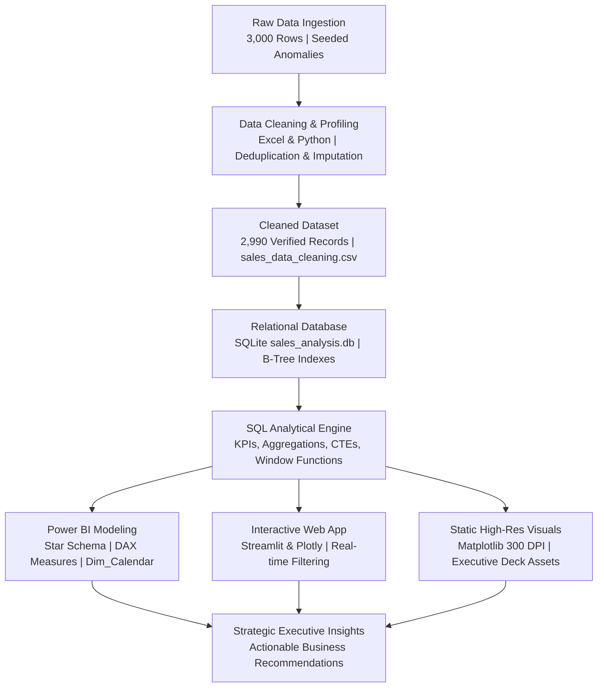

# 📊 Sales & Business Performance Analysis
### *End-to-End Commercial Analytics, SQL Relational Modeling, and Interactive Business Intelligence*

[](https://www.python.org/)
[](https://www.sqlite.org/)
[](https://powerbi.microsoft.com/)
[](https://streamlit.io/)
[](https://plotly.com/)
[](https://opensource.org/licenses/MIT)

---

## 📌 1. Executive Summary & Business Problem

In modern retail and e-commerce enterprises, commercial leadership frequently faces a critical strategic trade-off: **chasing top-line revenue volume at the expense of bottom-line profit margins**. Aggressive discounting often boosts sales figures while secretly eroding profitability, particularly in high unit-cost categories.

This project simulates the end-to-end analytical lifecycle of a **Senior Data Analyst** evaluating the commercial health of a mid-sized retail enterprise across a **24-month trading window (January 2023 – December 2024)**. 

### Core Project Scope:
- **Transaction Base**: Ingested 3,000 raw sales orders exhibiting controlled real-world data quality issues (duplicates, null values, inconsistent text casing, whitespace anomalies).
- **Data Engineering**: Cleansed, standardized, and validated **2,990 clean transactions** across 380 unique customers, 4 product categories, and 4 sales territories.
- **Relational Database Modeling**: Designed and indexed an **SQLite** database (`sales_analysis.db`) executing structured SQL analytical queries.
- **Business Intelligence**: Engineered an enterprise **Star Schema** data model and DAX measures in **Power BI**, complemented by an interactive **Streamlit + Plotly** web dashboard and publication-grade **Matplotlib** charts.
- **Strategic Impact**: Identified the *"Volume vs. Margin"* paradox and synthesized four high-impact commercial recommendations to optimize profit retention.

---

## 🎯 2. Executive Performance Scorecard

The analysis evaluated **2,990 verified orders** totaling **7,849 units** sold across the retail portfolio:

```text
╔═══════════════════════╦═══════════════════════╦═══════════════════════╗
║     TOTAL REVENUE     ║      NET PROFIT       ║  OVERALL MARGIN (%)   ║
║      $450,978.56      ║      $157,745.23      ║        34.98%         ║
╠═══════════════════════╬═══════════════════════╬═══════════════════════╣
║     TOTAL ORDERS      ║   UNIQUE CUSTOMERS    ║   AVG ORDER VALUE     ║
║      2,990 Orders     ║     380 Accounts      ║        $150.83        ║
╚═══════════════════════╩═══════════════════════╩═══════════════════════╝
```

---

## 🔄 3. End-to-End Analytics Architecture



---

## 💡 4. Deep-Dive Business Findings & Insights

### A. The "Volume vs. Margin" Paradox
A granular diagnosis across product categories revealed a stark divergence between revenue contribution and profitability efficiency:

| Category | Orders | Units Sold | Total Revenue ($) | Net Profit ($) | Profit Margin (%) | Commercial Characterization |
| :--- | :---: | :---: | :---: | :---: | :---: | :--- |
| **Technology** | 830 | 2,122 | **\$189,018.44** | **\$66,695.42** | **35.29%** | Primary Revenue Driver (High Vol / Healthy Margin) |
| **Furniture** | 622 | 1,684 | **\$183,965.24** | **\$51,943.84** | **28.24%** | Volume Driver / High Discount Risk (Lowest Margin) |
| **Electronics** | 597 | 1,631 | **\$46,543.94** | **\$21,917.84** | **47.09%** | Balanced High-Efficiency Add-on |
| **Office Supplies** | 934 | 2,400 | **\$30,524.93** | **\$16,867.62** | **55.26%** | Profit Multiplier (Highest Margin, Low Ticket) |

> **Key Takeaway**: **Technology** and **Furniture** generate **82.7%** of enterprise sales (\$373K). However, **Furniture exhibits the lowest profit margin (28.24%)** due to heavy promotional discounting (>20%) applied to high base-cost inventory. Conversely, **Office Supplies yields a massive 55.26% margin**, presenting a prime bundling opportunity.

---

### B. Top 5 Revenue-Generating Products
Five flagship products account for **$216,423.86** (**48.0%** of total enterprise sales):

| Rank | Product Name | Category | Units Sold | Revenue ($) | Profit ($) | Margin (%) | Strategic Action |
| :---: | :--- | :--- | :---: | :---: | :---: | :---: | :--- |
| **1** | **Standing Desk Converter** | Furniture | 267 | **\$62,784.93** | \$16,059.93 | 25.58% | Cap promotional discount at 15% |
| **2** | **USB-C Docking Station** | Technology | 291 | **\$41,037.18** | \$13,392.18 | 32.63% | Anchor SKU for enterprise B2B bundles |
| **3** | **Ergonomic Office Chair** | Furniture | 209 | **\$38,728.02** | \$9,886.02 | 25.53% | Restrict clearance sales thresholds |
| **4** | **Noise-Canceling Headset** | Technology | 322 | **\$38,009.04** | \$12,893.04 | 33.92% | Promote cross-sell during Q4 surge |
| **5** | **External SSD 1TB** | Technology | 328 | **\$35,834.91** | \$11,234.91 | 31.35% | Maintain current pricing stability |

---

### C. Regional Market Dynamics
Commercial performance across the four designated sales territories demonstrated remarkable margin consistency:

| Region | Total Orders | Units Sold | Total Revenue ($) | Net Profit ($) | Margin (%) | Regional Assessment |
| :--- | :---: | :---: | :---: | :---: | :---: | :--- |
| **East** | 826 | 2,097 | **\$121,757.68** | **\$42,952.11** | **35.28%** | Market Leader (Highest customer density) |
| **North** | 790 | 2,047 | **\$116,403.30** | **\$40,696.00** | **34.96%** | Strong secondary commercial market |
| **West** | 698 | 1,901 | **\$108,201.06** | **\$38,131.99** | **35.24%** | Stable volume with high corporate adoption |
| **South** | 672 | 1,793 | **\$104,223.63** | **\$35,792.74** | **34.34%** | Prime growth opportunity (\$17.5K gap vs. East) |

---

## 🚀 5. Actionable Business Recommendations

1. **Implement a 15% Maximum Discount Cap on Furniture**:
   - Restricting Furniture promotional markdowns to $\le 15\%$ prevents margin dilution on high-cost items like *Standing Desk Converters*, preserving an estimated **\$4,200 – \$6,500** in quarterly net earnings.
2. **Launch "Tech + Essentials" Checkout Bundles**:
   - Bundle high-margin **Office Supplies (55.26% margin)** with high-ticket **Technology hardware** (e.g., offer a discounted document organizer set when purchasing a docking station), driving Average Order Value (AOV) upwards without sacrificing hardware gross margin.
3. **Targeted Commercial Expansion in the South**:
   - Regional margins in the South (34.34%) are on par with the East (35.28%), but total revenue lags by \$17.5K. Allocating 15% more digital marketing spend to Southern corporate accounts will capture untapped enterprise demand.
4. **Institutionalize a B2B Loyalty & Rebate Program**:
   - 380 unique accounts generated 2,990 orders, representing a high repeat rate of **7.8 orders per customer**. Offering tiered annual volume rebates will secure recurring procurement cycles and defend against competitor poaching.

---

## 🛠️ 6. Technology Stack & Technical Justification

| Tool | Senior Analyst Role & Architectural Justification |
| :--- | :--- |
| **Microsoft Excel** | Initial data quality profiling, duplicate identification, text manipulation (`TRIM`, `PROPER`), and preliminary Pivot Table sanity checks. |
| **SQLite & SQL** | Serverless, zero-config relational database (`sales_analysis.db`). Fully ACID-compliant, B-tree indexed, and scriptable for automated, repeatable analysis. |
| **Power BI** | Enterprise BI modeling with a **Star Schema** architecture, dedicated date dimension (`Dim_Calendar`), and optimized DAX measures (`DIVIDE`, `CALCULATE`, `DATEADD`). |
| **Python (Streamlit & Plotly)** | Browser-based interactive dashboard (`app.py`) empowering non-technical stakeholders to slice, filter, and inspect data in real time. |
| **Matplotlib & Seaborn** | Publication-grade static visual generation (`300 DPI`) for board presentations and portfolio reports. |

---

## 💻 7. Interactive Dashboard & Quickstart Guide

### Run the Streamlit Dashboard Locally
To launch the interactive web dashboard on your machine:

```bash
# 1. Install required dependencies
pip install -r requirements.txt

# 2. Run the Streamlit application
streamlit run app.py
```
👉 Open your browser to **`http://localhost:8501`** to interact with real-time filters, dynamic KPI cards, and drill-down charts.

### Regenerate Static Visualizations
To re-create the high-resolution charts in `visuals/`:
```bash
python visuals/generate_charts.py
```

### Ingest Data & Execute SQL Queries
To rebuild the SQLite database and run the SQL analytical engine:
```bash
python sql/load_and_query.py
```

---

## 📂 8. Repository Structure & Deliverables Directory

```text
Sales-dashboard/
│
├── README.md                     # Executive project overview & documentation (this file)
├── DATASET_SCHEMA.md             # 10-column data dictionary, types, and constraints
├── sales_data_cleaning.csv       # Cleaned, standardized dataset (2,990 verified rows)
├── app.py                        # Interactive Streamlit & Plotly web dashboard
├── requirements.txt              # Cloud & local deployment dependencies
├── SPT.pbix                      # Power BI packaged dashboard file
│
├── data/
│   ├── raw_sales_data.csv        # Unprocessed raw sales dataset (3,000 transactions)
│   ├── generate_sales_data.py    # Deterministic dataset generator (Seed 42)
│   ├── clean_sales_data.py       # Automated Python cleaning & normalization pipeline
│   └── DATA_QUALITY_NOTES.md     # Anomaly audit specifications
│
├── sql/
│   ├── sales_analysis.db         # Staged SQLite database file
│   ├── schema_and_queries.sql    # DDL schema, index definitions, and KPI queries
│   ├── QUERY_RESULTS.md          # Formatted query execution outputs & statistical tables
│   └── load_and_query.py         # Automated database loader & query runner
│
├── excel/
│   ├── README.md                 # Excel data validation formulas & pivot table summary
│   ├── sales_data_cleaned.xlsx   # Cleaned workbook with formulas
│   └── sales_data_cleaning.xlsx  # Preliminary exploratory sheet
│
├── powerbi/
│   └── README.md                 # Star Schema design, DAX measures code, & 3-page layout guide
│
├── tableau/
│   └── README.md                 # Visual story outlines, geospatial mapping, & charts guide
│
├── visuals/
│   ├── 01_sales_trend.png        # Monthly Revenue & Profit Trend (Dual Line Chart)
│   ├── 02_top_5_products.png     # Top 5 Revenue-Generating Products (Horizontal Bar Chart)
│   ├── 03_category_sales_donut.png # Category Revenue Share & Margins (Donut Chart)
│   ├── 04_regional_performance.png # Regional Sales vs Net Profit (Clustered Bar Chart)
│   ├── generate_charts.py        # Python chart generation script
│   └── README.md                 # Visual gallery and chart documentation
│
└── documentation/
    ├── VIVA_VOCE_GUIDE.md        # Comprehensive viva voce Q&A and technical justification handbook
    ├── PROJECT_SUMMARY.md        # Full executive presentation deck summary
    └── README.md                 # Documentation directory index
```

---

## 🎓 9. Viva Voce & Technical Defense Highlights

When defending this project in an academic or technical interview setting, emphasize these senior analyst talking points:

1. **Why SQLite over MySQL/PostgreSQL?**  
   *Answer*: SQLite is self-contained, serverless, zero-config, and embeddable within any repository. It provides 100% ANSI SQL standard compliance without introducing database server overhead.
2. **Why use `DIVIDE()` in DAX instead of `/`?**  
   *Answer*: The native division operator `/` returns `NaN` or `Infinity` upon division by zero, breaking visual tiles. `DIVIDE([Profit], [Sales], 0)` intercepts divide-by-zero errors and returns a safe fallback (0).
3. **Why build a Star Schema in Power BI?**  
   *Answer*: Decoupling Dimensions (`Dim_Calendar`, `Dim_Product`, `Dim_Region`) from Facts (`sales_data`) eliminates redundant dimensional strings, leverages VertiPaq columnar compression, and simplifies DAX filter propagation.
4. **Why are negative profits present in the dataset?**  
   *Answer*: Negative profit realistically models retail promotional loss-leaders and margin erosion where high discounts (>20%–30%) outpace unit gross margins. Identifying and capping these transactions is a core data analyst responsibility.

---

## 📜 10. Project Milestone Status

- [x] **Phase 1: Project Scoping & Directory Architecture** (Completed)
- [x] **Phase 2: Dataset Schema & Data Dictionary Design** (Completed)
- [x] **Phase 3: Raw Data Generation with Controlled Real-World Noise** (Completed)
- [x] **Phase 4: Data Cleaning & Format Normalization in Excel** (Completed)
- [x] **Phase 5: SQLite Database Staging & SQL Querying** (Completed)
- [x] **Phase 6: Power BI Modeling & DAX Formulation** (Completed)
- [x] **Phase 7: High-Resolution Visual Gallery Generation** (Completed)
- [x] **Phase 8: Interactive Streamlit Web Dashboard Development** (Completed)
- [x] **Phase 9: Comprehensive Viva Voce Defense Guide** (Completed)
- [x] **Phase 10: GitHub Repository Version Control & Cloud Readiness** (Completed)
