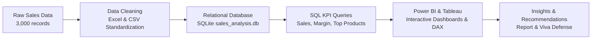

# 📊 Sales & Business Performance Analysis
> **A College-Level Data Analytics Project** designed for student Data Analyst portfolios and academic viva voce evaluation.

---

## 📌 1. Project Overview

The **Sales & Business Performance Analysis** project simulates the end-to-end workflow of a Junior Data Analyst in a retail/e-commerce company. The objective is to analyze transactional sales data to evaluate business health, track key performance indicators (KPIs), identify regional and product-level trends, and deliver actionable recommendations to improve revenue and operational efficiency.

This project deliberately focuses on core, practical data analyst competencies without unnecessary complexity (no machine learning, deep learning, or web applications).

---

## 🎯 2. Project Objectives & Core Focus Areas

The project addresses seven fundamental stages of data analytics:

1. **Data Cleaning**: Handling missing values, standardizing dates, resolving inconsistencies, removing duplicate entries, and verifying data integrity.
2. **Exploratory Data Analysis (EDA)**: Understanding distribution, sales volume patterns, seasonality, and customer purchasing habits.
3. **SQL Analysis**: Writing clean, structured SQL queries (joins, aggregations, CTEs, and window functions) to answer targeted business questions.
4. **Business KPIs**: Defining, calculating, and monitoring core commercial metrics (Revenue, Profit Margin, AOV, MoM Growth, etc.).
5. **Power BI Visualization**: Designing an interactive, executive-ready dashboard with DAX measures, slicers, and drill-down capabilities.
6. **Tableau Visualization**: Building clean, exploratory visual stories focusing on regional performance, category breakdowns, and customer segmentation.
7. **Business Insights & Recommendations**: Translating numbers and charts into concrete, data-backed business action plans suitable for stakeholder presentations.

---

## 🛠️ 3. Technology Stack

| Tool | Purpose in Project |
| :--- | :--- |
| **Microsoft Excel** | Initial inspection, data cleaning, pivot tables, quick sanity checks, and formula-based validation. |
| **SQL (MySQL / PostgreSQL / SQL Server)** | Relational data querying, data transformation, KPI calculation, CTEs, and window functions. |
| **Power BI** | Data modeling (Star Schema), DAX calculations, interactive executive dashboards, and KPI scorecards. |
| **Tableau** | Exploratory visual analytics, geospatial mapping, category comparisons, and visual storytelling. |

> **Scope Note**: Intentionally excludes Machine Learning, cloud deployments, web frameworks, and complex APIs to keep the focus purely on foundational Business Intelligence and Data Analysis.

---

## 📈 4. Key Performance Indicators (KPIs) & Metrics

This project tracks standard business KPIs essential for commercial evaluation and viva explanation:

| KPI | Description | Formula / Logic |
| :--- | :--- | :--- |
| **Total Revenue** | Gross monetary sales generated | $\sum (\text{Quantity} \times \text{Unit Price} \times (1 - \text{Discount}))$ |
| **Total Profit & Margin** | Net earnings and profit percentage | $\text{Revenue} - \text{Total Cost}$, $\frac{\text{Profit}}{\text{Revenue}} \times 100$ |
| **Average Order Value (AOV)** | Average money spent per order | $\frac{\text{Total Revenue}}{\text{Total Orders}}$ |
| **Sales Growth (MoM / YoY)** | Revenue change across periods | $\frac{\text{Current Period Sales} - \text{Prior Period Sales}}{\text{Prior Period Sales}} \times 100$ |
| **Order Volume & Units Sold** | Total orders and physical quantity | $\text{Count(OrderID)}$, $\sum \text{Quantity}$ |
| **Return / Cancellation Rate** | Ratio of returned orders | $\frac{\text{Returned Orders}}{\text{Total Orders}} \times 100$ |
| **Top & Bottom Performers** | Ranking products, categories, regions | Ranked by total revenue, volume, and profit margin |

---

## 📂 5. Project Folder Structure

```text
Sales Performance Analysis Project/
│
├── README.md                     # Main project documentation & project overview
├── DATASET_SCHEMA.md             # 10-column schema & data dictionary
├── sales_data_cleaning.csv       # Cleaned dataset (2,990 verified transactions)
├── app.py                        # Interactive Streamlit & Plotly web dashboard
├── requirements.txt              # Deployment dependencies (streamlit, pandas, plotly)
│
├── data/
│   ├── raw_sales_data.csv        # Source sales transaction dataset (3,000 rows)
│   ├── generate_sales_data.py    # Python data generator (seed 42)
│   └── DATA_QUALITY_NOTES.md     # Anomaly specifications for data cleaning
│
├── sql/
│   ├── sales_analysis.db         # SQLite database with loaded sales_data table
│   ├── schema_and_queries.sql    # Table schema, indexes, and KPI queries
│   ├── QUERY_RESULTS.md          # Executed query results & performance metrics
│   └── load_and_query.py         # Automated database ingestion and query runner
│
├── excel/
│   ├── README.md                 # Excel formulas, pivot table summary, and data prep notes
│   └── sales_data_cleaned.xlsx   # Cleaned Excel workbook
│
├── powerbi/
│   └── README.md                 # Data model guide, DAX measures list, and visual layout specs
│
├── tableau/
│   └── README.md                 # Tableau workbook overview, visual story outlines, and dashboard captures
│
├── visuals/
│   ├── 01_sales_trend.png        # Monthly Sales & Profit Trend (Line Chart)
│   ├── 02_top_5_products.png     # Top 5 Revenue Products (Bar Chart)
│   ├── 03_category_sales_donut.png # Category Revenue Share & Margins (Donut Chart)
│   ├── 04_regional_performance.png # Regional Sales & Profit Comparison (Bar Chart)
│   ├── generate_charts.py        # Python visualization generator script
│   └── README.md                 # Visual gallery and chart documentation
│
└── documentation/
    ├── VIVA_VOCE_GUIDE.md        # Comprehensive viva voce Q&A and technical justification guide
    ├── PROJECT_SUMMARY.md        # Executive presentation summary & strategic recommendations
    └── README.md                 # Documentation folder index
```

---

## 📊 6. Key Verified Project Metrics

| Metric | Output Value | Context / Performance Evaluation |
| :--- | :---: | :--- |
| **Total Revenue** | **\$450,978.56** | Gross sales across all 2,990 clean orders |
| **Total Net Profit** | **\$157,745.23** | Net margin after subtracting product unit costs |
| **Overall Profit Margin** | **34.98%** | Healthy commercial margin across retail portfolio |
| **Total Validated Orders** | **2,990** | Deduplicated from 3,000 raw rows (10 duplicate rows removed) |
| **Unique Customer Pool** | **380** | Demonstrates solid repeat purchasing (~7.8 orders/customer) |
| **Total Units Sold** | **7,849 units** | Physical inventory moved |
| **Average Order Value (AOV)** | **\$150.83** | Average transaction size across all categories |
| **Top Revenue Product** | **Standing Desk Converter** | **\$62,784.93** Sales (267 units sold, 25.58% margin) |
| **Top Revenue Category** | **Technology** | **\$189,018.44** Sales (35.29% profit margin) |
| **Highest Margin Category** | **Office Supplies** | **55.26% Margin** (high-margin add-on category) |
| **Top Sales Region** | **East** | **\$121,757.68** Sales (35.28% margin) |

---

## 🔄 7. End-to-End Project Workflow



1. **Data Acquisition & Assessment**: Designed realistic transactional schema with 10 exact columns and generated 3,000 rows with controlled real-world data issues ([DATASET_SCHEMA.md](file:///c:/Users/pango/Downloads/GOURAV''S%20PROJECT/DATASET_SCHEMA.md)).
2. **Cleaning & Validation**: Removed 10 duplicate rows, resolved missing values, standardized category and regional casing, yielding 2,990 verified transactions ([sales_data_cleaning.csv](file:///c:/Users/pango/Downloads/GOURAV''S%20PROJECT/sales_data_cleaning.csv)).
3. **SQL Database & Query Analysis**: Staged cleaned data into SQLite ([sql/sales_analysis.db](file:///c:/Users/pango/Downloads/GOURAV''S%20PROJECT/sql/sales_analysis.db)). Executed KPI queries revealing \$450,978.56 in Total Sales and 34.98% overall profit margin ([sql/QUERY_RESULTS.md](file:///c:/Users/pango/Downloads/GOURAV''S%20PROJECT/sql/QUERY_RESULTS.md)).
4. **Power BI Dashboarding**: Designed Star Schema data model (`Dim_Calendar` connected to `sales_data`), configured core DAX measures, and defined 3-page layout specifications ([powerbi/README.md](file:///c:/Users/pango/Downloads/GOURAV''S%20PROJECT/powerbi/README.md)).
5. **Tableau Visual Exploration**: Built complementary visual stories focusing on geospatial distributions and category profitability ([tableau/README.md](file:///c:/Users/pango/Downloads/GOURAV''S%20PROJECT/tableau/README.md)).
6. **Executive Reporting & Viva Preparation**: Synthesized findings into an executive report ([documentation/PROJECT_SUMMARY.md](file:///c:/Users/pango/Downloads/GOURAV''S%20PROJECT/documentation/PROJECT_SUMMARY.md)) and full viva defense handbook ([documentation/VIVA_VOCE_GUIDE.md](file:///c:/Users/pango/Downloads/GOURAV''S%20PROJECT/documentation/VIVA_VOCE_GUIDE.md)).

---

## 🎓 8. Complete Project Deliverables Directory

| Deliverable Area | Primary File | Description |
| :--- | :--- | :--- |
| **Executive Summary** | [PROJECT_SUMMARY.md](file:///c:/Users/pango/Downloads/GOURAV''S%20PROJECT/documentation/PROJECT_SUMMARY.md) | High-level commercial insights, paradox analysis, and strategic recommendations |
| **Viva Voce Defense** | [VIVA_VOCE_GUIDE.md](file:///c:/Users/pango/Downloads/GOURAV''S%20PROJECT/documentation/VIVA_VOCE_GUIDE.md) | Comprehensive interview questions covering SQL, Excel, Power BI, and technical choices |
| **Cleaned Dataset** | [sales_data_cleaning.csv](file:///c:/Users/pango/Downloads/GOURAV''S%20PROJECT/sales_data_cleaning.csv) | Deduplicated, standardized dataset (2,990 records) |
| **Raw Dataset** | [raw_sales_data.csv](file:///c:/Users/pango/Downloads/GOURAV''S%20PROJECT/data/raw_sales_data.csv) | Original 3,000 rows with seeded anomalies |
| **Data Dictionary** | [DATASET_SCHEMA.md](file:///c:/Users/pango/Downloads/GOURAV''S%20PROJECT/DATASET_SCHEMA.md) | 10-column data specifications, constraints, and business rules |
| **Database File** | [sales_analysis.db](file:///c:/Users/pango/Downloads/GOURAV''S%20PROJECT/sql/sales_analysis.db) | Self-contained SQLite database with indexed `sales_data` table |
| **SQL Script** | [schema_and_queries.sql](file:///c:/Users/pango/Downloads/GOURAV''S%20PROJECT/sql/schema_and_queries.sql) | DDL schema, indexes, and analytical queries |
| **SQL Execution Results** | [QUERY_RESULTS.md](file:///c:/Users/pango/Downloads/GOURAV''S%20PROJECT/sql/QUERY_RESULTS.md) | Markdown tables of executed query outputs |
| **Power BI Architecture** | [powerbi/README.md](file:///c:/Users/pango/Downloads/GOURAV''S%20PROJECT/powerbi/README.md) | Star Schema model, DAX measures formulas, and 3-page layout design |
| **Visual Dashboard Charts** | [visuals/README.md](file:///c:/Users/pango/Downloads/GOURAV''S%20PROJECT/visuals/README.md) | High-resolution PNG visual charts generated via Python & Matplotlib |
| **Interactive Web App** | [app.py](file:///c:/Users/pango/Downloads/GOURAV''S%20PROJECT/app.py) | Full interactive browser dashboard built with Streamlit & Plotly |

---

## 🚀 9. Project Implementation Status

- [x] **Phase 1: Project Scoping & Directory Setup** (Completed)
- [x] **Phase 2: Dataset Schema & Data Dictionary Design** (Completed)
- [x] **Phase 3: Raw Data Generation with Controlled Anomalies** (Completed)
- [x] **Phase 4: Data Cleaning & Validation in Excel** (Completed)
- [x] **Phase 5: SQL Database Setup & Analytical Queries** (Completed)
- [x] **Phase 6: Power BI Modeling & DAX Documentation** (Completed)
- [x] **Phase 7: Executive Presentation & Insights Summary** (Completed)
- [x] **Phase 8: Comprehensive Viva Voce Preparation Guide** (Completed)
- [x] **Phase 9: Visual Charts Generation (Matplotlib/Python)** (Completed)
- [x] **Phase 10: Interactive Web Dashboard (Streamlit & Plotly)** (Completed)
