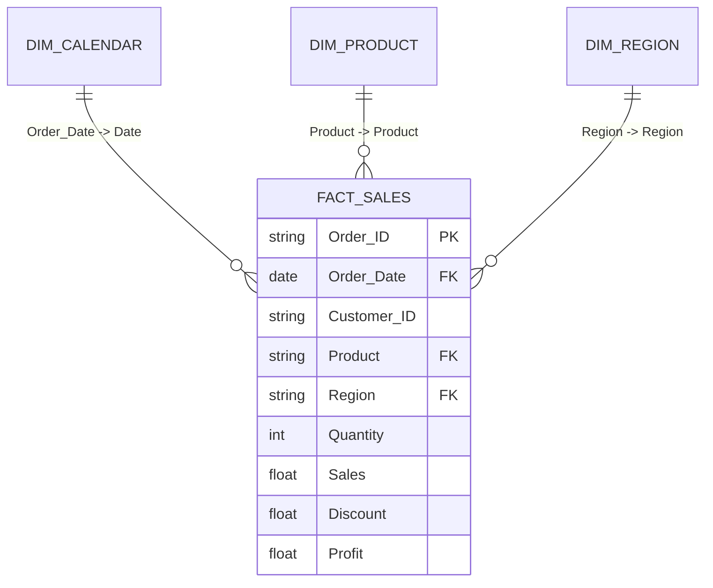

# 📊 Power BI Dashboard Implementation & Modeling Guide

**Project**: Sales & Business Performance Analysis  
**Target File**: `sales_data_cleaning.csv` / `sql/sales_analysis.db`  
**Tool**: Power BI Desktop  
**Target Audience**: College Data Analyst Portfolio & Viva Voce Evaluation  

---

## 📑 Table of Contents
1. [Data Import & Power Query Transformation](#1-data-import--power-query-transformation)
2. [Data Modeling & Star Schema Architecture](#2-data-modeling--star-schema-architecture)
3. [Key DAX Measures & Business Logic](#3-key-dax-measures--business-logic)
4. [Report Page Design & Visual Layouts](#4-report-page-design--visual-layouts)
5. [Interactive Features & Best Practices](#5-interactive-features--best-practices)
6. [Academic & Viva Voce Talking Points](#6-academic--viva-voce-talking-points)

---

## 📥 1. Data Import & Power Query Transformation

### Step-by-Step Data Connection
1. Launch **Power BI Desktop**.
2. On the Home ribbon, click **Get Data** > **Text/CSV**.
3. Select `sales_data_cleaning.csv` from the project directory.
4. In the preview window, select **Transform Data** to open the **Power Query Editor**.

### Power Query Data Type Validation
Ensure each column is assigned its precise data type:

| Column Name | Power Query Data Type | Transformation Action |
| :--- | :--- | :--- |
| `Order_ID` | **Text** | Set to Text. Verify no blanks. |
| `Order_Date` | **Date** | Set to Date (`YYYY-MM-DD`). |
| `Customer_ID` | **Text** | Set to Text. |
| `Product` | **Text** | Text format. |
| `Category` | **Text** | Capitalize Each Word (`Text.Proper`). |
| `Region` | **Text** | Capitalize Each Word (`Text.Proper`). |
| `Quantity` | **Whole Number** | Integer (`Int64.Type`). |
| `Sales` | **Fixed Decimal Number** | Currency / 2 decimal places. |
| `Discount` | **Percentage / Decimal** | Decimal number (0.00 to 1.00). |
| `Profit` | **Fixed Decimal Number** | Currency / 2 decimal places. |

5. Click **Close & Apply** to load the dataset into the Power BI Data Model.

---

## 🏗️ 2. Data Modeling & Star Schema Architecture

To optimize performance and follow BI industry standards, the model uses a **Star Schema** centered on the transactional fact table.



### Creating the Dedicated Date Table (`Dim_Calendar`)
Standard time-intelligence functions in DAX require a contiguous, dedicated date table. In Power BI, navigate to the **Modeling** tab, select **New Table**, and enter:

```dax
Dim_Calendar = 
ADDCOLUMNS(
    CALENDAR(DATE(2023, 1, 1), DATE(2024, 12, 31)),
    "Year", YEAR([Date]),
    "Quarter", "Q" & FORMAT([Date], "Q"),
    "Month Number", MONTH([Date]),
    "Month Name", FORMAT([Date], "mmmm"),
    "Month-Year", FORMAT([Date], "mmm yyyy"),
    "Month-Year Sort", YEAR([Date]) * 100 + MONTH([Date]),
    "Day of Week", FORMAT([Date], "dddd")
)
```
> **Tip**: Select the `Month-Year` column in `Dim_Calendar` and set **Sort by Column** to `Month-Year Sort` to avoid alphabetical ordering.

### Establishing Model Relationships
In the **Model View**, configure:
- **`Dim_Calendar[Date]` (1) ➔ `sales_data[Order_Date]` (*)**:
  - Cardinality: **One to Many (1:*)**
  - Cross filter direction: **Single**

---

## 🧮 3. Key DAX Measures & Business Logic

Organize all calculations inside a dedicated table named `_Measures` (**Home > Enter Data > Table Name: `_Measures`**).

### Core Performance Measures

#### 1. Total Sales
```dax
Total Sales = SUM(sales_data[Sales])
```
*Format: Currency (`$#,##0.00`)*

#### 2. Total Profit
```dax
Total Profit = SUM(sales_data[Profit])
```
*Format: Currency (`$#,##0.00`)*

#### 3. Profit Margin (%)
```dax
Profit Margin % = 
DIVIDE(
    [Total Profit], 
    [Total Sales], 
    0
)
```
*Format: Percentage (`0.00%`)*

#### 4. Total Orders
```dax
Total Orders = DISTINCTCOUNT(sales_data[Order_ID])
```
*Format: Whole Number (`#,##0`)*

#### 5. Total Units Sold
```dax
Total Units Sold = SUM(sales_data[Quantity])
```
*Format: Whole Number (`#,##0`)*

#### 6. Average Order Value (AOV)
```dax
Average Order Value = 
DIVIDE(
    [Total Sales], 
    [Total Orders], 
    0
)
```
*Format: Currency (`$#,##0.00`)*

---

### Time-Intelligence & Growth Measures

#### 7. Previous Month Sales
```dax
Previous Month Sales = 
CALCULATE(
    [Total Sales], 
    DATEADD(Dim_Calendar[Date], -1, MONTH)
)
```

#### 8. Month-over-Month (MoM) Sales Growth (%)
```dax
MoM Sales Growth % = 
VAR _CurrentSales = [Total Sales]
VAR _PriorSales = [Previous Month Sales]
RETURN
DIVIDE(
    _CurrentSales - _PriorSales, 
    _PriorSales, 
    0
)
```
*Format: Percentage (`+0.00%;-0.00%;0.00%`)*

#### 9. Year-to-Date (YTD) Sales
```dax
YTD Sales = 
TOTALYTD(
    [Total Sales], 
    Dim_Calendar[Date]
)
```

---

## 🖥️ 4. Report Page Design & Visual Layouts

The dashboard is structured into **3 analytical pages**:

```text
┌─────────────────────────────────────────────────────────────┐
│ Page 1: Executive Performance Summary                       │
├─────────────────────────────────────────────────────────────┤
│ Page 2: Product & Category Analytics                        │
├─────────────────────────────────────────────────────────────┤
│ Page 3: Regional Sales & Geographic Insights                │
└─────────────────────────────────────────────────────────────┘
```

---

### Page 1: Executive Performance Summary
*Purpose: High-level overview of commercial health for C-suite and examiners.*

- **Top KPI Cards**:
  - `[Total Sales]` ($450.98K)
  - `[Total Profit]` ($157.75K)
  - `[Profit Margin %]` (34.98%)
  - `[Total Orders]` (2,990)
  - `[Average Order Value]` ($150.83)
- **Primary Trend (Line & Clustered Column Chart)**:
  - **X-axis**: `Dim_Calendar[Month-Year]`
  - **Column values**: `[Total Sales]`
  - **Line values**: `[Profit Margin %]`
  - *Identifies seasonal surges in Q4 and monthly profitability stability.*
- **Donut Chart**:
  - **Legend**: `sales_data[Category]`
  - **Values**: `[Total Sales]`
  - *Reveals dominant revenue share of Technology & Furniture.*
- **Top Slicers Panel**:
  - Date Range Slider (`Dim_Calendar[Date]`)
  - Region dropdown buttons (`sales_data[Region]`)

---

### Page 2: Product & Category Analytics
*Purpose: Granular diagnosis of merchandise performance and discount impact.*

- **Clustered Bar Chart**: Top 5 Products by Sales
  - **Y-axis**: `sales_data[Product]`
  - **X-axis**: `[Total Sales]`
  - **Data Labels**: Enabled
  - *Highlights Standing Desk Converter and USB-C Docking Station.*
- **Category Matrix Table**:
  - **Rows**: `Category` > `Product` (expandable drill-down)
  - **Values**: `[Total Orders]`, `[Total Units Sold]`, `[Total Sales]`, `[Total Profit]`, `[Profit Margin %]`
  - **Conditional Formatting**: Background color data bars on `[Total Sales]`; Green-to-Red gradient on `[Profit Margin %]`.
- **Scatter Plot (Discount vs Profitability)**:
  - **X-axis**: `sales_data[Discount]`
  - **Y-axis**: `[Total Profit]`
  - **Legend**: `sales_data[Category]`
  - *Visually demonstrates how discounts over 20% suppress profit.*

---

### Page 3: Regional Sales & Geographic Insights
*Purpose: Territory evaluation and resource allocation analysis.*

- **Map Visual / Filled Map**:
  - **Location**: `sales_data[Region]`
  - **Bubble Size / Color Saturation**: `[Total Sales]`
- **100% Stacked Bar Chart**:
  - **Y-axis**: `sales_data[Region]`
  - **X-axis**: `[Total Sales]`
  - **Legend**: `sales_data[Category]`
  - *Compares product mix composition across North, South, East, and West.*
- **KPI Summary Cards by Selected Region**:
  - Dynamic indicators that update automatically when clicking any region.

---

## 🎨 5. Interactive Features & Best Practices

1. **Cross-Filtering**: Clicking any category in the Donut Chart instantly cross-filters all other visuals on the page.
2. **Bookmarks & Clear Filters Button**: Add a "Reset Filters" button using a bookmark to improve user experience.
3. **Consistent Theme**:
   - Primary: `#1F4E79` (Navy Blue)
   - Secondary: `#2E75B6` (Medium Blue)
   - Accent / Profit: `#2CA02C` (Forest Green)
   - Warning / Deficit: `#D9534F` (Soft Red)

---

## 🎓 6. Academic & Viva Voce Talking Points

When presenting your Power BI work to faculty or examiners, be prepared to answer:

- **Q1: Why did you use `DIVIDE([Total Profit], [Total Sales], 0)` instead of `[Total Profit] / [Total Sales]`?**  
  *Answer*: The native division operator `/` will throw a runtime error or return `NaN`/`Infinity` if the denominator is zero. `DIVIDE()` safely handles zero denominators and allows specifying an alternate result (e.g., 0).
- **Q2: Why is a dedicated Calendar/Date table necessary in Power BI?**  
  *Answer*: Power BI's built-in time intelligence functions (`DATEADD`, `TOTALYTD`, `SAMEPERIODLASTYEAR`) require an unbroken, contiguous date sequence marked as a Date Table to calculate comparisons across periods accurately.
- **Q3: What is the difference between a Calculated Column and a Measure?**  
  *Answer*: A Calculated Column computes at row-level during data refresh and consumes RAM storage. A Measure computes on-the-fly at query time based on user filter context and consumes zero static storage.
- **Q4: What is the Star Schema advantage in this project?**  
  *Answer*: It decouples dimensions (Calendar, Product, Region) from transaction facts (Sales, Quantity, Profit), minimizing data redundancy, boosting calculation speed, and simplifying DAX logic.
